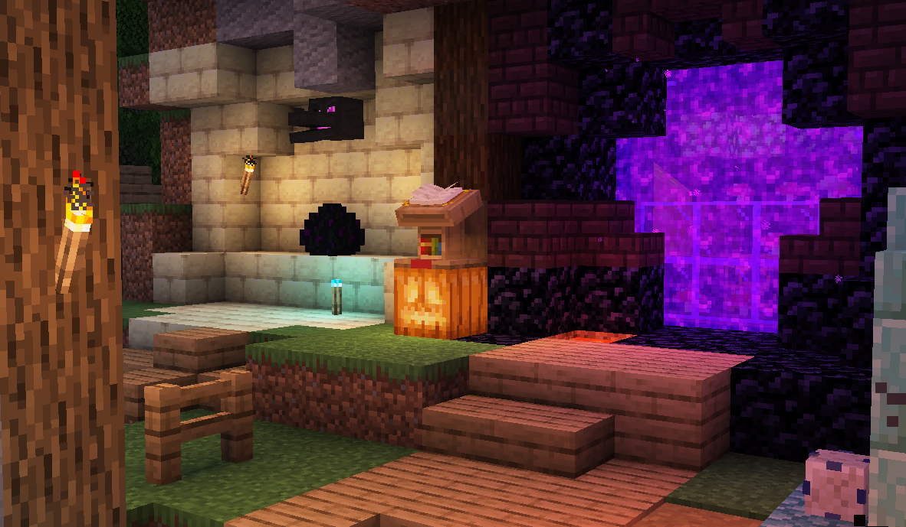
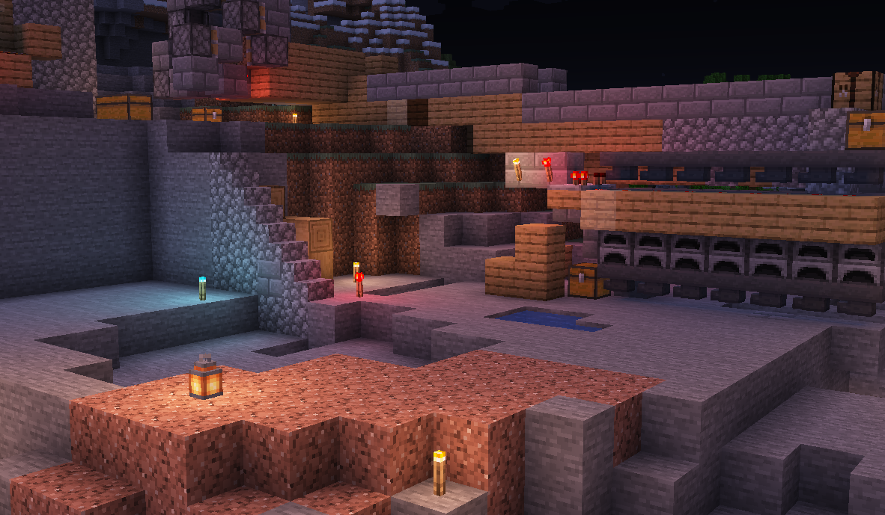

  

<h1 align = "center">VanillaVX</h1>

A shader pack for Minecraft with Iris adding variable-color lighting

## features

- variable-color block lighting using flood-fill algorithm
- colored lighting from handheld items
